# 🗓️ Weekender: The Hyper-Local Event Concierge

### A Multi-Agent System powered by Gemini 2.5 & 2.0 Flash

**Capstone Project for Google AI Agents Intensive 2025**
*Track: Concierge Agents*

## 📖 The Pitch

### Problem Statement
Planning a weekend outing is surprisingly laborious because it suffers from "App Toggling Fatigue." A user must manually switch between a Weather app, Google Maps, Eventbrite, and Yelp to piece together a plan. By the time a suitable event is found, tickets may be sold out, or the user might realize the venue is outdoors and it is raining. This disjointed process forces users to act as project managers for their own free time, often leading to decision fatigue or cancelled plans.

### Solution Statement
Weekender automates the entire planning lifecycle by acting as an intelligent concierge rather than a passive search engine. It autonomously researches real-time data (weather, events), cross-references it with a persistent user memory (dietary restrictions, music tastes), and synthesizes a conflict-free itinerary. This transforms the planning process from a 45-minute logistical chore into a single 30-second conversation, allowing users to focus on enjoying their time rather than managing it.

### Architecture
Core to Weekender is a Multi-Agent System that splits the cognitive load between specialized roles. It is not a monolithic script but a workflow of distinct agents contributing to different stages of the planning process.

The real power of Weekender lies in its team of specialized sub-agents:

The Researcher (Gemini 2.0 Flash): This agent serves as the "eyes" of the system. It is optimized for speed and tool usage. Its sole responsibility is to ingest the user's request, identify the necessary data points (e.g., "Is it raining?", "What jazz clubs are open?"), and execute external search tools to gather raw facts without bias.

The Concierge (Gemini 2.5 Pro): Once the facts are gathered, the Concierge takes over. This agent acts as the "brain," optimized for reasoning and empathy. It synthesizes the raw data with the User Profile, filtering out options that don't match the user's tastes (e.g., filtering out outdoor events if rain is detected) and drafting a polite, formatted itinerary.

### Essential Tools and Utilities
The agents are equipped with specific tools to bridge the gap between the LLM and the real world:

DuckDuckGo Search Wrapper (search_web): A robust tool that allows the Researcher agent to fetch real-time information about local events and weather forecasts. I implemented a fallback logic system: if the search API times out or returns error codes, the system gracefully degrades to cached backup data to ensure the user always receives a response.

User Profile Memory (InMemorySession): To function as a true concierge, the system maintains a persistent dictionary of user preferences (e.g., "User dislikes spicy food"). This allows for context-aware recommendations that improve over time without the user needing to repeat their constraints.

### Value Statement
Weekender reduced the typical weekend planning time from approximately 45 minutes of manual research to a sub-minute interaction. It enables users to discover local events they would otherwise miss due to the friction of searching multiple platforms.

If I had more time, I would add an Integration Agent capable of connecting to the Google Calendar API and OpenTable API. This would allow Weekender to not just suggest an itinerary, but actively book the table and block the time on the user's calendar, closing the loop completely.

---

## ⚙️ Architecture & Key Concepts

This project demonstrates **3 Key Course Concepts**:

### 1. Multi-Agent System (Sequential Pattern)
I implemented a "Planner-Executor" workflow using two distinct Gemini models:
* **`Researcher Agent` (Gemini 2.0 Flash):** Optimized for speed and tool use. It scrapes the web for raw facts.
* **`Concierge Agent` (Gemini 2.5 Pro):** Optimized for reasoning and creative writing. It takes the raw facts and drafts the final email.

### 2. Tool Use (Function Calling)
The agent is equipped with a custom Python tool:
* **`search_web(query)`:** A wrapper around DuckDuckGo Search that fetches real-time event data and weather forecasts, preventing hallucinations.

### 3. Sessions & Memory
The system utilizes a structured **User Profile Memory**.
* Instead of asking *"What do you like?"* every time, the agent loads a `user_profile` dict containing dietary restrictions and music preferences to filter search results automatically.

### Architecture Diagram

```mermaid
graph TD
    User[User Request] --> Main[Orchestrator]
    Main --> Memory[(User Profile Memory)]
    
    subgraph "Agent Workflow"
        Main --> Researcher[🕵️ Researcher Agent<br/>Gemini 2.0 Flash]
        Researcher -- Call Tool --> Tools[DuckDuckGo Search]
        Tools -- Raw Data --> Researcher
        Researcher -- Facts --> Concierge[🎩 Concierge Agent<br/>Gemini 2.5 Pro]
    end
    
    Concierge --> Output[Final Itinerary]
```

## 🚀 Setup & Usage
### Prerequisites

1.Python 3.8+
2. A Google Gemini API Key

## Installation
Clone the repository
git clone [https://github.com/YOUR_USERNAME/weekender_agent.git](https://github.com/YOUR_USERNAME/weekender_agent.git)
cd weekender_agent
## Install dependencies
pip install -r requirements.txt
## Set up API Key Create a .env file in the root directory:
GEMINI_API_KEY=your_api_key_here
## Run the Agent
python main.py

## 📸 Demo Output
Below is a real execution log demonstrating the Multi-Agent hand-off.

## 🔮 Future Improvements
### Calendar Integration: 
Allow the agent to add the itinerary directly to Google Calendar.

### Booking Tool:
Add a tool to reserve tables via OpenTable API.
