# 🗓️ Weekender: The Hyper-Local Event Concierge

### A Multi-Agent System powered by Gemini 2.5 & 2.0 Flash

**Capstone Project for Google AI Agents Intensive 2025**
*Track: Concierge Agents*

## 📖 The Pitch

### The Problem
Planning a weekend outing is surprisingly stressful. It involves "App Toggling Fatigue": checking the Weather app, then Google Maps, then Eventbrite, and finally Yelp to find food. By the time you find an event, you realize it's raining or the restaurant is fully booked.

### The Solution
**Weekender** is an intelligent concierge agent that unifies this process. You give it a vague intent (*"I want a fun Saturday night"*), and it autonomously:
1.  **Researches** real-time weather and local events.
2.  **Cross-references** your personal memory profile (likes/dislikes).
3.  **Synthesizes** a conflict-free, personalized itinerary.

### The Value
Reduces a 45-minute fragmented planning task into a **30-second** interaction.

---

## ⚙️ Architecture & Key Concepts

This project demonstrates **3 Key Course Concepts**:

### 1. Multi-Agent System (Sequential Pattern)
I implemented a "Planner-Executor" workflow using two distinct Gemini models:
* **`Researcher Agent` (Gemini 2.0 Flash):** Optimized for speed and tool use. It scrapes the web for raw facts.
* **`Concierge Agent` (Gemini 2.5 Pro):** Optimized for reasoning and creative writing. It takes the raw facts and drafts the final email.

### 2. Tool Use (Function Calling)
The agent is equipped with a custom Python tool:
* **`search_web(query)`:** A wrapper around DuckDuckGo Search that fetches real-time event data and weather forecasts, preventing hallucinations.

### 3. Sessions & Memory
The system utilizes a structured **User Profile Memory**.
* Instead of asking *"What do you like?"* every time, the agent loads a `user_profile` dict containing dietary restrictions and music preferences to filter search results automatically.

### Architecture Diagram

```mermaid
graph TD
    User[User Request] --> Main[Orchestrator]
    Main --> Memory[(User Profile Memory)]
    
    subgraph "Agent Workflow"
        Main --> Researcher[🕵️ Researcher Agent<br/>Gemini 2.0 Flash]
        Researcher -- Call Tool --> Tools[DuckDuckGo Search]
        Tools -- Raw Data --> Researcher
        Researcher -- Facts --> Concierge[🎩 Concierge Agent<br/>Gemini 2.5 Pro]
    end
    
    Concierge --> Output[Final Itinerary]
```

## 🚀 Setup & Usage
### Prerequisites

1.Python 3.8+
2. A Google Gemini API Key

## Installation
Clone the repository
git clone [https://github.com/YOUR_USERNAME/weekender_agent.git](https://github.com/YOUR_USERNAME/weekender_agent.git)
cd weekender_agent
## Install dependencies
pip install -r requirements.txt
## Set up API Key Create a .env file in the root directory:
GEMINI_API_KEY=your_api_key_here
## Run the Agent
python main.py

## 📸 Demo Output
Below is a real execution log demonstrating the Multi-Agent hand-off.

## 🔮 Future Improvements
### Calendar Integration: 
Allow the agent to add the itinerary directly to Google Calendar.

### Booking Tool:
Add a tool to reserve tables via OpenTable API.
